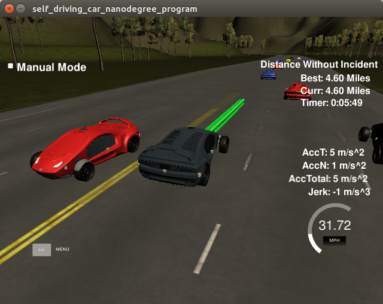

# CarND-Path-Planning-Project
Self-Driving Car Engineer Nanodegree Program

### Goals
In this project my goal is to safely navigate around a virtual highway with other traffic that is driving +-10 MPH of the 50 MPH speed limit. The car should try to go as close as possible to the 50 MPH speed limit, which means passing slower traffic when possible. The car should avoid hitting other cars at all cost as well as driving inside of the marked road lanes at all times, unless going from one lane to another. The car should be able to make one complete loop around the 6946m highway. Since the car is trying to go 50 MPH, it should take a little over 5 minutes to complete 1 loop. Also the car should not experience total acceleration over 10 m/s^2 and jerk that is greater than 10 m/s^3. [Click here](https://www.youtube.com/watch?v=u9ciFQRXGm4&feature=youtu.be) for final video.

### Compilation
Code compile without errors with cmake and make.

```
xfxh@myubuntu:/media/xfxh/70D214ABD2147814/carnd_term3/CarND-Path-Planning-Project$ mkdir build && cd build
xfxh@myubuntu:/media/xfxh/70D214ABD2147814/carnd_term3/CarND-Path-Planning-Project/build$ cmake .. && make
-- The C compiler identification is GNU 5.4.0
-- The CXX compiler identification is GNU 5.4.0
-- Check for working C compiler: /usr/bin/cc
-- Check for working C compiler: /usr/bin/cc -- works
-- Detecting C compiler ABI info
-- Detecting C compiler ABI info - done
-- Detecting C compile features
-- Detecting C compile features - done
-- Check for working CXX compiler: /usr/bin/c++
-- Check for working CXX compiler: /usr/bin/c++ -- works
-- Detecting CXX compiler ABI info
-- Detecting CXX compiler ABI info - done
-- Detecting CXX compile features
-- Detecting CXX compile features - done
-- Configuring done
-- Generating done
-- Build files have been written to: /media/xfxh/70D214ABD2147814/carnd_term3/CarND-Path-Planning-Project/build
Scanning dependencies of target path_planning
[ 50%] Building CXX object CMakeFiles/path_planning.dir/src/main.cpp.o
[100%] Linking CXX executable path_planning
[100%] Built target path_planning
```

### Valid Trajectories

#### 1.The car is able to drive at least 4.32 miles without incident.

The car ran about 6 miles without incidents




#### 2.The car drives according to the speed limit.

The car doesn't drive faster than the speed limit. Also the car isn't driving much slower than speed limit unless obstructed by traffic. No speed limit red message was seen.

#### 3.Max Acceleration and Jerk are not Exceeded.

The car does not exceed a total acceleration of 10 m/s^2 and a jerk of 10 m/s^3. Max jerk red message was not seen.

#### 4.Car does not have collisions.

The car does not come into contact with any of the other cars on the road. Collisions red message was not seen.

#### 5.The car stays in its lane, except for the time between changing lanes.

Most of the time, the car stays in  its lane, but change lanes when ahead car speed is slow or change to center lane.

#### 6.The car is able to change lanes

The car change lanes when ahead car speed is slow or change to center lane.

### Reflection

#### 1.Prediction no-ego cars

line 259 to line 323

```c++
bool car_go_ahead = false;
bool car_on_left = false;
bool car_on_right = false;
               

for(int i =0;i<sensor_fusion.size();i++)
{
    float d = sensor_fusion[i][6];
    int car_lane =-1;
    //first check which lane the no-ego vehicle is
    if(d>=0 && d<4)
    {
    	car_lane = 0;
    }
    else if(d>=4 && d<8)
    {
    	car_lane = 1;
    }
    else if(d>=8 && d<=12)
    {
    	car_lane =2;
    }
    else
    {
    	//do nothing
    }

    if(car_lane <0)
    {
    	continue;
    }

    //find car speed
    double vx =sensor_fusion[i][3];
    double vy =sensor_fusion[i][4];

    double check_speed =sqrt(vx*vx+vy*vy);
    double check_car_s = sensor_fusion[i][5];

    // if using previous points, can project s value outwards in time
    check_car_s += ((double)prev_size*0.02*check_speed);


    if (car_lane == lane)
    {
    	//no-ego car in our lane
    	car_go_ahead |= check_car_s > car_s && check_car_s - car_s <30;
    }
    else if (car_lane -lane == -1)
    {
    	//no-ego car left
    	car_on_left |= car_s-check_car_s<30 && check_car_s-car_s<30;
    }
    else if (car_lane- lane == 1)
    {
    	//no-geo car right
    	car_on_right |= car_s-check_car_s<30 && check_car_s-car_s<30;
    }
    else
    {
    	//do nothing
    }
}
```

Use the sensor fusion data to find whether there has a no-ego car ahead from ego car, whether there has  a no-ego car on the left/right lane will affect the ego car to change lane. Calculating the lane each no-ego car is and the position it will be when at the end of the previous plan trajectory. When the distance between no-ego car and ego car is less than 30 m, it is considered as not safe.

#### 2.Behavior planner

line 326 to line 362

```c++
double speed_diff = 0;
const double MAX_SPEED =49.5;
const double MAX_ACC =0.224;
if(car_go_ahead)
{
	//no-ego car ahead
	if (!car_on_left && lane > 0)
	{
		//if there is no other car left and there is a left lane.
		lane--;//change to left lane
	}
	else if(!car_on_right && lane !=2)
	{
		//if there is no other car right and there is a right lane.
		lane++;
	}
	else
	{
		speed_diff -= MAX_ACC;
	}
}
else
{
	if(lane!=1)
	{
		//if we are not on the center lane.
		if ((lane ==0 && !car_on_right) || (lane == 2 && !car_on_left))
		{
			lane =1;//go back to center
		}
	}

	if (ref_vel < MAX_SPEED)
	{
		speed_diff += MAX_ACC;
	}
}
```

Given the prediction of the no-ego cars around ego car, when a slow no-ego car ahead ego car , left and right direction do have no lane to change or it is not safe to change lane, the no-ego car will slow down. If a slow no-ego car ahead ego car, and left or right lane is safe to change, the no-ego wil change the lane. If no-ego car is not in center lane and it is safe to change to center lane, the no-ego car will get back to center lane. Use speed_diff to creat the speed change, when generating trajectory use this change will make the car more responsive to act the speed change.

#### 3.Trajectory generation

line 369 to 495

```c++
//creat a list of widely spaced (x,y) waypoints, later use spline

                vector<double> ptsx;
                vector<double> ptsy;

                //reference x,y,yaw sates, either starting point where the car is or the previous paths end point
                 
                double ref_x = car_x;
                double ref_y = car_y;
                double ref_yaw = deg2rad(car_yaw);
                           
                //if previous size is almost empty, use the car as starting reference
                if(prev_size < 2)
                {    
                    //use two points that make the path tangent to car
                    double prev_car_x = car_x - cos(car_yaw);
                    double prev_car_y = car_y - sin(car_yaw);

                    ptsx.push_back(prev_car_x);
                    ptsx.push_back(car_x);

                    ptsy.push_back(prev_car_y);
                    ptsy.push_back(car_y);
                }
                //use the previous path's end point as starting reference
                else
                {
                    //redefine reference state as previous path end point
                    ref_x = previous_path_x[prev_size-1];
                    ref_y = previous_path_y[prev_size-1];

                    double ref_x_prev = previous_path_x[prev_size-2];
                    double ref_y_prev = previous_path_y[prev_size-2];
                    ref_yaw = atan2(ref_y - ref_y_prev, ref_x - ref_x_prev);

                    // use two points that make the path tangent to the previous path's end point
                    ptsx.push_back(ref_x_prev);
                    ptsx.push_back(ref_x);

                    ptsy.push_back(ref_y_prev);
                    ptsy.push_back(ref_y);
                }

                //in Frenet add 30m spaced points ahead of the starting reference
                vector<double> next_wp0 = getXY(car_s+30, (2+ 4*lane),map_waypoints_s,map_waypoints_x,map_waypoints_y);
                vector<double> next_wp1 = getXY(car_s+60, (2+ 4*lane),map_waypoints_s,map_waypoints_x,map_waypoints_y);
                vector<double> next_wp2 = getXY(car_s+90, (2+ 4*lane),map_waypoints_s,map_waypoints_x,map_waypoints_y);

                ptsx.push_back(next_wp0[0]);
                ptsx.push_back(next_wp1[0]);
                ptsx.push_back(next_wp2[0]);

                ptsy.push_back(next_wp0[1]);
                ptsy.push_back(next_wp1[1]);
                ptsy.push_back(next_wp2[1]);

                for(int i = 0; i< ptsx.size(); i++)
                {
                  //shift car reference angle to 0 degress
                  double shift_x = ptsx[i]-ref_x;
                  double shift_y = ptsy[i]-ref_y;
      
                  ptsx[i] = shift_x *cos(0-ref_yaw) - shift_y*sin(0-ref_yaw);
                  ptsy[i] = shift_x *sin(0-ref_yaw) + shift_y*cos(0-ref_yaw);

                }

                //create a spline
                tk::spline s;

                //set (x,y) points to the spline
                s.set_points(ptsx,ptsy);

                //define the acutal (x,y) points we will use for the planner
          	vector<double> next_x_vals;
          	vector<double> next_y_vals;

                //start with all of the previous path points from last time
                for(int i = 0; i<previous_path_x.size();i++)
                {
                   next_x_vals.push_back(previous_path_x[i]);
                   next_y_vals.push_back(previous_path_y[i]);
                }

                //calculate how to break up spline points so that  we travel at our desired reference velocity
                double target_x = 30.0;
                double target_y = s(target_x);
                double target_dist = sqrt(target_x*target_x + target_y*target_y);

                double x_add_on = 0;

                //fill up the rest of our path planner after filling it with previous points, here we will always output 50 points
                for(int i =1; i <= 50- previous_path_x.size(); i++)
                {

                    ref_vel += speed_diff;
                    if (ref_vel >MAX_SPEED)
                    {
                        ref_vel = MAX_SPEED;
                    }
                    else if (ref_vel < MAX_ACC)
                    {
                        ref_vel = MAX_ACC;
                    }
                    else
                    {
                        //do nothing
                    }

                    double N = (target_dist/(0.02*ref_vel/2.24));
                    double x_point = x_add_on + target_x/N;
                    double y_point = s(x_point);

                    x_add_on = x_point;

                    double x_ref = x_point;
                    double y_ref = y_point;
                
                    //rotate back to normal after rotating it eariler
                    x_point = x_ref * cos(ref_yaw) - y_ref*sin(ref_yaw);
                    y_point = x_ref * sin(ref_yaw) + y_ref*cos(ref_yaw);

                    x_point += ref_x;
                    y_point += ref_y;

                    next_x_vals.push_back(x_point);
                    next_y_vals.push_back(y_point);

                }

```

The last two points of the previous trajectory or the car position (when there is almost no previous trajectory) are used to combine with other three far distance ponits to initialize the spline. To make live easy, the coordinates are transformed to locad car coordinates from map coordinate. To make the trajectory more smooth, the rest previous trajectory points are used with the new trajectory. The new trajectory is calculating by evaluating the spline, then all the trajectory change the coordinates from local car coordinates to map coordinate. The speed value will affect the space between two points the spline evaluated.

### Dependencies

* cmake >= 3.5

  * All OSes: [click here for installation instructions](https://cmake.org/install/)
* make >= 4.1
  * Linux: make is installed by default on most Linux distros
  * Mac: [install Xcode command line tools to get make](https://developer.apple.com/xcode/features/)
  * Windows: [Click here for installation instructions](http://gnuwin32.sourceforge.net/packages/make.htm)
* gcc/g++ >= 5.4
  * Linux: gcc / g++ is installed by default on most Linux distros
  * Mac: same deal as make - [install Xcode command line tools]((https://developer.apple.com/xcode/features/)
  * Windows: recommend using [MinGW](http://www.mingw.org/)
* [uWebSockets](https://github.com/uWebSockets/uWebSockets)
  * Run either `install-mac.sh` or `install-ubuntu.sh`.
  * If you install from source, checkout to commit `e94b6e1`, i.e.
    ```
    git clone https://github.com/uWebSockets/uWebSockets 
    cd uWebSockets
    git checkout e94b6e1
    ```
